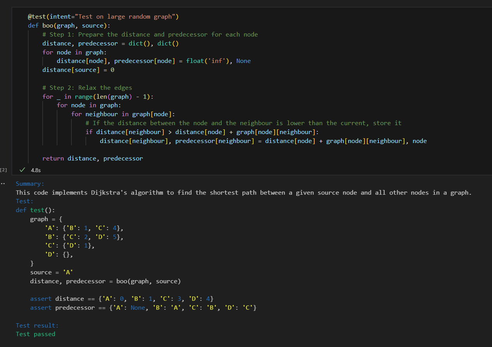

# Auto test - python decorator that uses Azure services to generate and test your code

## How to use

```python
# import decorator
from auto_test import test

#use decorator, intent is optional
@test(intent="n =10")
def fib(n):
    if n < 2:
        return n
    return fib(n - 2) + fib(n - 1)

```

Optionaly you can specify 5 options via config:
```python
from auto_test import auto_test_config
# those are options and how to set them
auto_test_config.SUMMARIZE = True # if True, will use summarization to create prompt
auto_test_config.TEST = True # if False, will not run tests, nor query API
auto_test_config.DEBUG = False # if True, will print out prompts and responses
auto_test_config.VERBOSE = False # if True, will print out raw API responses
auto_test_config.SAVE_TESTS = False # if True, will save tests to file for inspection
```

## How it works

This tool is a testing framework for Python code that uses OpenAI API on Azure to generate responses. It consists of a decorator function that can be applied to any python function.

This tool 4 modes of operation, based on two parameters.
1. Is summary generation enabled?
2. Is testing intent provided?

Based on those two parameters, right prompt is used.

Thanks to summary we create a chain of thoughts prompt, and giving user a way to check if LLM is aligned with user.

We also give an option to incorporate intent into the prompt. So specific functionality can be tested, and to give user more control over the process.

## Example
